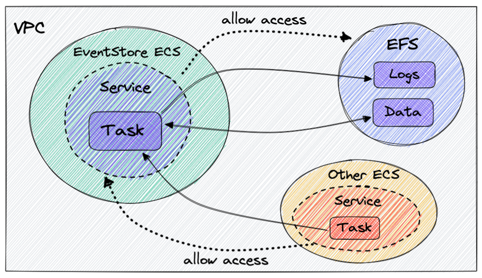

Event store can be deployed as a managed instance via [Event Store Cloud](https://www.eventstore.com/event-store-cloud) which will take care of availability, clustering and other candies. The only drawback is the high [cost](https://www.eventstore.com/event-store-cloud/pricing) of the hosting resources plus a separate cost (also high IMO 😛) for [support](https://www.eventstore.com/support). Here we won't take any fancy shortcuts with managed clouds and do it on our own in `AWS` using infrastructure as code with [`CDK`](https://aws.amazon.com/cdk/) in `Typescript`. We will have one event store cluster running in ECS `Fargate` service accessing an external file system, or [EFS](https://aws.amazon.com/efs/).

The `CDK` code is available on [`github`](https://github.com/MargaretKrutikova/event-store-aws-cdk).

Quick links to content:

- [Setup overview](#setup-overview)
- [CDK best practices](#cdk-best-practices)
- [CDK Infrastructure](#cdk-infrastructure)
  - [Stateful resources](#stateful-resources)
  - [Event store](#event-store)
  - [Creating stacks and dependencies](#creating-stacks-and-dependencies)
  - [Enable access to event store](#enable-access-to-event-store)
- [Scientific diagram of how everything hangs together](#scientific-diagram-of-how-everything-hangs-together)
- [Access EventStore Admin UI](#access-eventstore-admin-ui)
- [Bonus: generating certificate](#bonus-generating-certificate)
- [Next steps](#next-steps)
- [Acknowledgments](#acknowledgments)

## Setup overview

Our `CDK` code will:

- create a [VPC](https://aws.amazon.com/vpc/) (Virtual Private Cloud) where the file system will reside,
- create a file system for persisting events,
- spin up a container running `EventStoreDB` on ECS [Fargate](),
- configure security group access to the event store from another `Fargate` service.

## CDK best practices

A couple of very important `CDK` [best practices](https://aws.amazon.com/blogs/devops/best-practices-for-developing-cloud-applications-with-aws-cdk/) that we will follow in our setup:

- organize app in logical units that extend `Construct`,
- group constructs into deployment units that extend `Stack`,
- separate stacks with stateful and stateless resources.

Following these will greatly help when your app grows - you will need to refactor or add more resources. For the above setup we will have:

- Constructs:
  - VPC where we will attach the file system and ECS cluster for event store,
  - file system,
  - ECS cluster and `Fargate` service for running event store,
- Stacks:
  - a stateful stack with the VPC and EFS constructs,
  - a stateless stack with the event store construct.

## CDK Infrastructure

EFS is a stateful resource and it depends on VPC (removing it will nuke the EFS), so it makes sense to group these two resources in one stack. The rest - ECS cluster and event store service - belong to a separate stack that can be destroyed and re-deployed without any data loss.

### Stateful resources

Here is how the [vpc](https://github.com/MargaretKrutikova/event-store-aws-cdk/blob/master/lib/constructs/vpc.ts) and [file system](https://github.com/MargaretKrutikova/event-store-aws-cdk/blob/master/lib/constructs/file-system.ts) look, one thing to note is `enableAutomaticBackups` when creating the file system:

```ts
new efs.FileSystem(this, "AppFileSystem", {
  vpc: props.vpc,
  ...
  removalPolicy: RemovalPolicy.RETAIN,
  enableAutomaticBackups: true,
})
```

You can configure backups manually or turn on automatic backups (`enableAutomaticBackups` is set to `true`). However you need to be aware of the default setting of automatic backups. According to the [docs](https://docs.aws.amazon.com/aws-backup/latest/devguide/create-auto-backup.html):

> The default backup window (the time frame when the backup will run) is set to start at 5 AM UTC (Coordinated Universal Time) and lasts 8 hours.

And to ensure consistent backups AWS [recommends](https://docs.aws.amazon.com/efs/latest/ug/alternative-efs-backup.html) pausing any writes to the file system or unmounting it during the backup.

If you don't want to keep these default settings, you shouldn't enable automatic backups and instead configure your own backup vault and backup rules, e.g. here is a backup rule to run at 2AM UTC within 2 hours:

```ts
const backupVault = new backup.BackupVault(...);

const plan = new backup.BackupPlan(this, "FileSystemBackupPlan`, {
    backupVault,
    backupPlanRules: [
      new backup.BackupPlanRule({
        completionWindow: Duration.hours(2),
        startWindow: Duration.hours(1),
        scheduleExpression: events.Schedule.cron({ hour: "2", minute: "0" }),
        deleteAfter: Duration.days(35),
      }),
    ],
});
```

Once you enable automatic backups and change your mind later, the automatic backup vault can't be removed. It will just be there, cold and lonely, until the end of times.

Now the stateful resources and their dependencies (VPC and file system) are packaged into a deployment unit [`StatefulStack`](https://github.com/MargaretKrutikova/event-store-aws-cdk/blob/master/lib/stateful-stack.ts). From this stack we expose the VPC and file system as two publicly accessible properties so that our event store construct can use them later when constructing the app:

```ts
export class StatefulStack extends Stack {
  fileSystem: FileSystem;
  vpc: IVpc;

  constructor(scope: Construct, id: string, props?: StackProps) {
    this.vpc = ...;
    this.fileSystem = ...;
  }
}
```

### Event store

This beast is tricky, here is what we do:

- create an ECS cluster to run a `Fargate` service,
- create volumes for event store logs and data in the file system,
- create a `Fargate` task definition and attack the volumes,
- create an event store container and mount the volumes,
- create a `Fargate` service and connect it with the task definition,
- give the `Fargate` service access to the file system.

[Here](https://github.com/MargaretKrutikova/event-store-aws-cdk/blob/master/lib/constructs/event-store.ts) is the full code for the event store construct. It needs access to the file system and the VPC and we can pass them as props when creating an instance of the construct.

Let's assume we have created a cluster and a `Fargate` task definition:

```ts
const cluster = new ecs.Cluster(...)
const taskDefiniton = new ecs.FargateTaskDefinition(...)
```

Next we create volumes and attach them to the task definition:

```ts
const esVolumeLogs: ecs.Volume = {
  name: "eventstore-volume-logs",
  efsVolumeConfiguration: {
    fileSystemId: props.fileSystem.fileSystemId,
  },
}

const esVolumeData: ecs.Volume = {
  name: "eventstore-volume-data",
  efsVolumeConfiguration: {
    fileSystemId: props.fileSystem.fileSystemId,
    transitEncryption: "ENABLED",
  },
}

taskDefinition.addVolume(esVolumeLogs)
taskDefinition.addVolume(esVolumeData)
```

When creating an event store we are pulling an [eventstore](https://hub.docker.com/r/eventstore/eventstore) image from docker hub, specifying two external ports for `TCP` (1113) and `HTTP` (2113) communication:

```ts
const esContainer = taskDefinition.addContainer("EventStoreContainer", {
  image: ecs.ContainerImage.fromRegistry(
    "eventstore/eventstore:21.10.0-buster-slim"
  ),
  containerName: "EventStore",
  portMappings: [{ containerPort: 2113 }, { containerPort: 1113 }],
  user: "root",
  environment: {
    EVENTSTORE_CLUSTER_SIZE: "1",
    EVENTSTORE_EXT_TCP_PORT: "1113",
    EVENTSTORE_HTTP_PORT: "2113",
    EVENTSTORE_ENABLE_EXTERNAL_TCP: "true",
    EVENTSTORE_INSECURE: "true",
  },
})
```

`EventStore` image supports built-in self-signed or real certificate, see event store [security](https://developers.eventstore.com/server/v5/security.html#security). Setting `EVENTSTORE_INSECURE` to `true` will allow us to skip this for now, we will deal with it later.

And now we can mount the volumes we created earlier:

```ts
esContainer.addMountPoints({
  containerPath: "/var/log/eventstore",
  sourceVolume: esVolumeLogs.name,
  readOnly: false,
})

esContainer.addMountPoints({
  containerPath: "/var/lib/eventstore",
  sourceVolume: esVolumeData.name,
  readOnly: false,
})
```

Last, we create a `Fargate` service on the cluster and with the task definition defined above.

### Creating stacks and dependencies

In our [`bin/app.ts`](https://github.com/MargaretKrutikova/event-store-aws-cdk/blob/master/bin/app.ts) we assemble the stacks and constructs taking into account their dependencies. An instance of `StatefulStack` is created first, the event store stack is created on the fly inside the construct and accepts resources from `StatefulStack` as dependencies in `props`:

```ts
const app = new cdk.App()

const statefulResources = new StatefulStack(app, "StatefulResources")

const eventStoreResources = new EventStoreConstruct(
  new Stack(app, "EventStore"),
  "EventStore",
  {
    fileSystem: statefulResources.fileSystem,
    vpc: statefulResources.vpc,
  }
)
```

### Enable access to event store

Assume we have another `Fargate` service and we want to give it access to our event store. We need to add inbound rules in the event store security group to allow access on specific ports from the security group of this new service.

Ideally we don't want to configure security group rules inside the event store construct/stack because it will invert the dependency arrow - it is not the event store that depends on that external service, but the external service depends on the event store. In this way the deployment cycle of the event store is not affected by deployments of the dependent stacks.

One solution is to allow other `CDK` constructs to configure access to the event store security group that we can expose from the event store construct. The plan is:

- expose `connections` object from the `Fargate` service on the construct,
- pass the `connections` as a dependency in `props` in the other service construct,
- configure access to the service security group via `allowTo`.

Changes we want to make inside the event store construct:

```ts
export class EventStoreConstruct extends Construct {
  connections: ec2.Connections;

  constructor(scope: Construct, id: string, props: EventStoreProps) {
    super(scope, id);
    const fargateService = new ecs.FargateService(..);

    // a lot of code

    this.connections = fargateService.connections;
  }
}
```

And our service construct:

```ts
type OtherServiceProps = {
  vpc: IVpc;
  eventStoreConnections: ec2.IConnectable;
};

export class OtherServiceConstruct extends Construct {
  constructor(scope: Construct, id: string, props: OtherServiceProps) {
    // setup cluster, fargate service, task definition etc.

    const fargateService = new ecs.FargateService(...);

    fargateService.connections.allowTo(props.eventStoreConnections, ec2.Port.tcp(2113));
    fargateService.connections.allowTo(props.eventStoreConnections, ec2.Port.tcp(1113));
  }
}
```

Our [`bin/app.ts`](https://github.com/MargaretKrutikova/event-store-aws-cdk/blob/master/bin/app.ts#L22) can now include the new service and accept event store connections as dependency.

## Scientific diagram of how everything hangs together

Here is a highly scientific graph of the AWS resources and connections between them:



## Access EventStore Admin UI

You can enable access to `EventStore` [Admin UI](https://developers.eventstore.com/server/v5/admin-ui.html#dashboard) for testing purposes by exposing port `2113` to your IP in the inbound rules of the security group that belongs to the `Fargate` service we created above. This is not pretty, but hej, we are having fun here ... You should be able to access the Admin UI at `http://<FARGATE_TASK_IP>:2113`.

I guess it goes without saying that you should remove your IP from the rules and set up a more robust solution (external `DNS`, service discovery via `AWS Cloud Map` etc) when going live.

## Bonus: generating certificate

To secure communication to/from event store we can generate a certificate with the [certification generation tool](https://developers.eventstore.com/server/v20.10/security.html#certificate-generation-tool) that comes with event store. There is a docker image and a CLI that will generate a certificate authority and a node certificate for `EventStoreDB`, located in a separate `github` repo [`es-gencert-cli`](https://github.com/EventStore/es-gencert-cli).

This task is not for the faint-hearted, the complete code can be looked at/copied entirely at your discretion [here](https://github.com/MargaretKrutikova/event-store-aws-cdk/blob/master/lib/constructs/event-store-cert.ts).

The certificate won't be stored in the file system but in the `Fargate` task storage and will be re-generated every time the task is updated. Here are the steps:

- create a bind mount host volume and attack it to the task definition,
- add container with `es-gencert-cli` image and specify command that will generate a certificate and place it in task storage,
- add mount point to the container,
- add the certificate generator container to the dependencies in the main event store container.

The communication to/from the event store is now encrypted with a self-signed certificate. A more production-ready setup would be nice, but hej, it is just an experiment for now.

## Next steps

Things to do before going live:

- add logging and alerts to the event store container,
- change the default password and save it in AWS SecretsManager so that event store clients can safely access it,
- add cloud map service discovery to the event store `Fargate` service.

## Acknowledgments

I had the chance to carry out this cool experiment while working at a wonderful place, called [Insurello](https://insurello.se/blogg/#tech) in Stockholm, Sweden, with the help of my brilliant colleagues. They do tons of functional programming with `F#` and `Elm`, event sourcing, AWS with `CDK` and much more (I am not employed there right now and I miss them).
