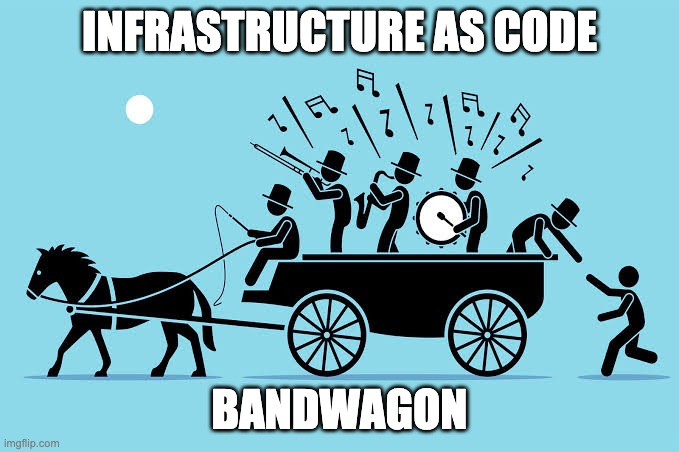
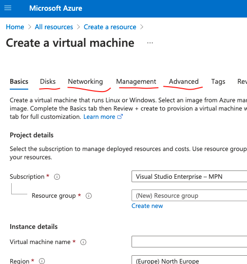
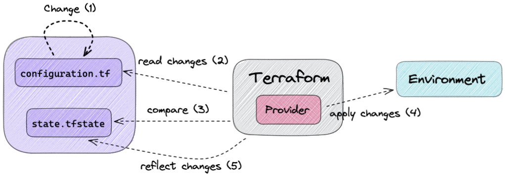
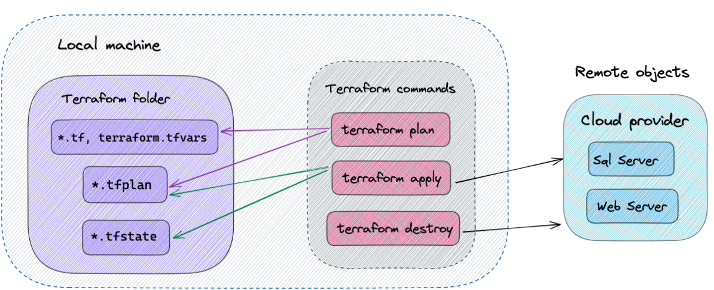

Also published at [dev.to](https://dev.to/margaretkrutikova/why-iac-and-high-level-overview-of-terraform-4die).

Infrastructure as code, or **IaC**, is becoming more and more mature nowadays and there are many tools that allow describing infrastructure in code, such [`terraform`](https://www.terraform.io/), [`pulumi`](https://www.pulumi.com/), [`farmer`](https://compositionalit.github.io/farmer/) (`Azure` only) etc. Let's see why we should jump on IaC bandwagon and understand its main ideas and benefits, and also learn how terraform implements them.

## What is infrastructure?

It is where your app and its individual parts live - virtual machines, networks, load balancers, db servers, message queues etc. With cloud providers like `Azure`, you might have specific resources such as web app, cosmos db, storage account etc.

A common way of managing infrastructure is manual intervention via some GUI (all of us have at least once logged in to a production server to make a "small" change 😅), writing custom configuration tools to implement a specific setup etc. All of this can become error-prone: no one knows why a change was made to the environment or why stuff just stopped working, which leads to hours of troubleshooting on the production servers.. fun stuff 😱

With modern cloud providers, manual configuration would look like this: you open your favorite browser, enter [`https://portal.azure.com/`](https://portal.azure.com/) and click through the UI to create a virtual machine:

So what does IaC do to mitigate these issues?

## IaC goals

- Reproducible infrastructure. Dev, stage, prod environments are consistent, easily reproduced and tested. Stop logging into your server and tweaking some settings or installing some software - you won't be able to reproduce it later and won't know why stuff broke.
- Manage infrastructure state in a **declarative** way. If you need to make changes to you environment, you don't need to think about **how** to achieve it or what's already present in the environment. The imperative way is: if **A** is not installed run command **B**, then run command **C** to apply setting **D** to **A**. The declarative way is: I want to have **A** with setting **C** in my environment, make it happen.
- Increase automation. Apply infrastructure changes as part of the deployment process. Minimize manual human labour (and thus decrease the number of mistakes made).
- Keep infrastructure configuration version-controlled to make changes easier, trace back changes made overtime, collaborate with others and all the other fun stuff one can do with `git`.

# Terraform

[Terraform](https://www.hashicorp.com/products/terraform) allows representing infrastructure as code. Or kinda code ... not like `F#` or `C#`, but more like _declarative configuration files_, like `json` or `yml` but with some support for functions, modules, etc. The language is called `HCL` - [HashiCorp Configuration Language](https://www.terraform.io/docs/language/index.html).

Keeping with the _declarative paradigm_ of IaC, the idea is that you tell `terraform` what the desired state of the infrastructure is and it will make it happen.

## How it works

You install `terraform` on your machine (fun fact - it is written in `Go`) and run `terraform` commands in a terminal.

You tell `terraform` what you want your environment to look like by writing your configuration in `.tf` files in some folder on your machine. The real state of the environment that corresponds to the configuration is tracked in a terraform state file and acts as a **source of truth**. When making changes to the configuration, `terraform` will use the current state file to know what changes to make in the environment so that it matches the new configuration.

Do not bypass `terraform` by changing your environment via GUI or elsewhere, `terraform` state file won't match the actual configuration!

## Terraform provider

`Terraform` can work with different cloud platforms - `Azure`, `Amazon`, `Digital Ocean`, etc. Code you write will differ depending on the cloud platform, since they usually have their own resources and rules specific for that platform.

`Terraform` itself is agnostic of the underlying platform, but for managing remote objects on that platform it needs to know how to interact with it - in other words how to call the platform's API to create/modify/delete resources. This is done via terraform plugins called providers. You will need to install a specific cloud provider locally before creating your infrastructure with terraform.

Here is the sequence of actions terraform takes to make changes to the remote environment:

## Terraform commands

You run `terraform` commands in a terminal to apply changes to the configuration:

- `plan` - reads current state, compares to the configuration, creates a plan of changes (preview of the actions),
- `apply` - executed the action proposed in the plan on remote objects,
- `destroy` - delete all remote infrastructure for the configuration.

Terraform supports many other exciting features, like remote backends, workspaces, modules etc, but that's for another time.

# Conclusion

You don't want to use GUI (or other configuration tool) to do infrastructure because:

- you can't track what changes are made overtime,
- you can't easily reproduce them elsewhere,
- you can't easily revert them if something goes boom 💥
- you can't have it as a deployment step.

You want to use infrastructure as code to:

- track changes to the infrastructure in `git`,
- share and collaborate with others,
- revert changes easily if something goes wrong,
- make changes easily,
- recreate the same environment easily many times,
- automate changes to the infrastructure during deployment.

Terraform implements IaC and stores a file with the state of your remote environment, keeps track of the differences between the configuration and the current state and synchronizes the state file with the environment after changes have been made.
