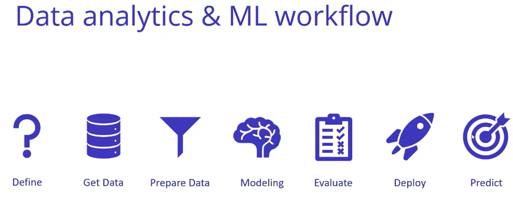
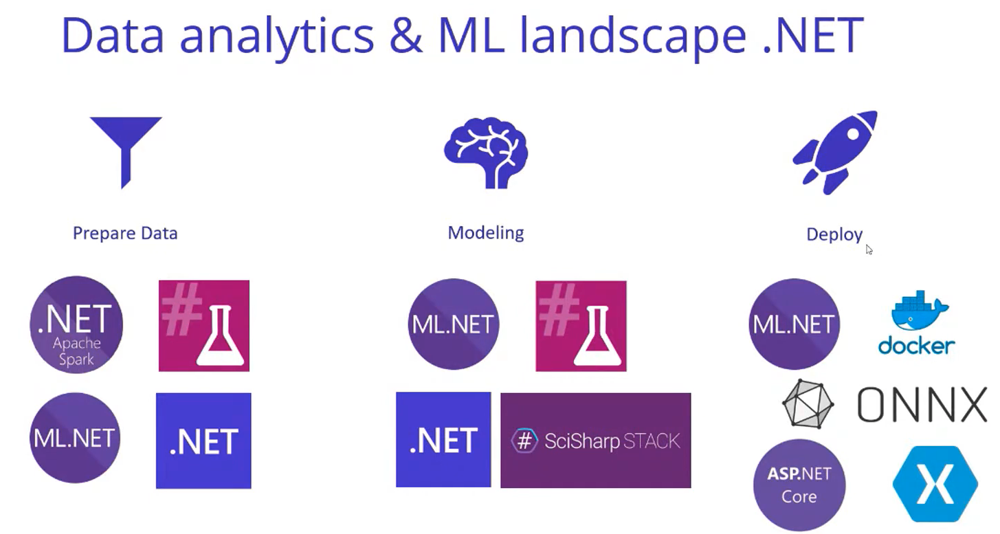

https://focus.dotnetconf.net/agenda

# Data Science with F

- fsdocs
- FsLab for data science

Model - some forecasting with ML
Transform data with F#, visualize the model etc.

Import data with FSharp.Data - multiple data sources.
Transformation with Deedle - data frame part, keeps the original data immutable and creates a new data frame.

Plotly.NET - visualizations.

FSharp.Stats - statistical testing, signal detection, ml etc.

More: https://fslab.org

## Lab experiments

You need to keep track of as many parameters as possible because any of them can influence the experiment results: how much light, temperature, length of the day etc.

Goal: store digital structured metadata - swate, excel with office.js api. Using ontologies and not free text. Automatically adding machine readable information to the columns to perform metadata analysis on the structured metadata.

## Proteomics

Protein identification.

Computationally complex pipeline.
Galaxy project.

Conda tools.

Dotnet tools on galaxy.

# Data analytics and ML in F

@ljquintanilla

Modeling - training with different algorithms for the data set.
Model is deployed as a webservice. Later you need to go back and retrain the model.

These tools are mostly Python oriented.
www.anaconda.com/state-of-data-science-2021

Dependencies in fsharp scripts: `#r "nuget:FSharp.Data"`

.NET Apache Spark - .net bindings for spark
ML.NET - not only train but also use pre-trained models from other systems and make predictions. Interop with models from other frameworks.

TensorFlow.NET, ONNX

## End to end ML workflow

FsLab ML.NET Apache Spark

.NET notebook. Predict scores of the restaurant inspection.

1. Data preparation with Spark inside .net notebook
   Date frame - data in a tabular format
   Visualize with Plotly.NET
   Spark partitions data and processes it in batches.

2. Train model with ML and ML.AutoML
   AutoML with automatically search algorithms and types of params and provides guidance.
   Save serialized version of the model and load at a later step in api.
3. Evaluate
4. Deploy
   WebApi - register service called prediction engine pool - creates an object pool of prediction engine objects - makes it scalable.

List of resources for data science & ML with F#: https://www.theurlist.com/dotnet-conf-fsharp-ml
